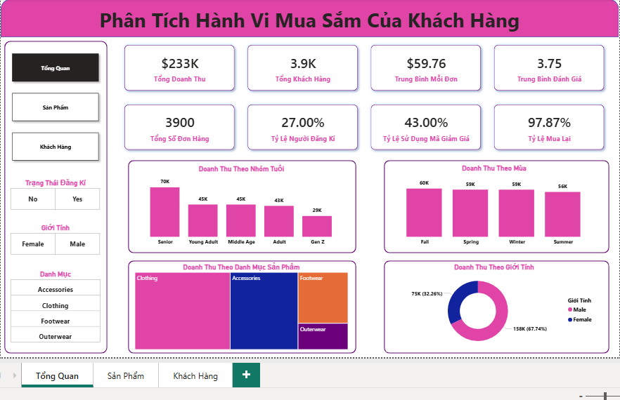
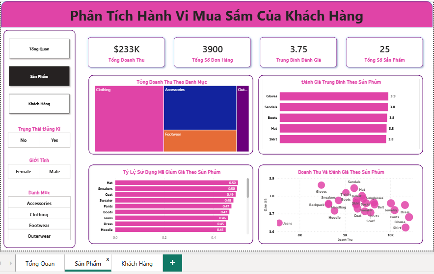
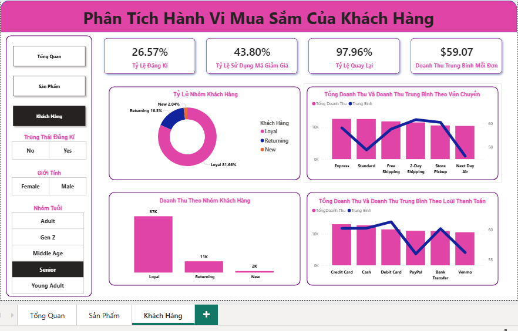

# Customer Shopping Behavior Analysis

## 📌 Project Overview

This project analyzes customer shopping behavior using retail transaction data to uncover insights into spending patterns, customer segments, product performance, and purchasing trends.

The project follows an end-to-end Data Analytics workflow:

- Data Cleaning & Exploration using Python
- Business Analysis using SQL (PostgreSQL)
- Interactive Dashboard Development using Power BI
- Business Recommendations based on data insights

---

## 📊 Dashboard Preview

### Overview Dashboard



### Product Dashboard



### Customer Dashboard



---

## 🎯 Business Objectives

- Understand customer purchasing behavior.
- Identify high-value customer segments.
- Analyze product performance.
- Evaluate subscription effectiveness.
- Measure the impact of discounts on sales.
- Generate actionable business recommendations.

---

## 📊 Dataset Information

| Metric | Value |
|----------|----------|
| Records | 3,900 |
| Features | 18 |
| Domain | Retail / Customer Shopping Behavior |

### Main Features

#### Customer Information

- Age
- Gender
- Location
- Subscription Status

#### Purchase Information

- Item Purchased
- Category
- Purchase Amount
- Season

#### Shopping Behavior

- Previous Purchases
- Review Rating
- Shipping Type
- Discount Applied

---

## 🐍 Exploratory Data Analysis (Python)

The dataset was cleaned and prepared using Python.

### Key Tasks

- Data quality assessment
- Missing value treatment
- Column standardization
- Feature engineering
- Data consistency validation

### Output

```text
notebooks/
```

---

## 🗄️ SQL Business Analysis

Business questions were answered using PostgreSQL.

### Customer Analysis

- Revenue by age group
- Revenue by gender
- Customer segmentation
- Subscription impact on spending
- Subscription impact on repeat purchases

### Product Analysis

- Top revenue categories
- Top-selling products
- Highest-rated products
- Discount-dependent products

### Sales Analysis

- Impact of discounts on sales
- Revenue by season

### Operational Analysis

- Shipping performance

SQL Scripts:

```text
sql/
```

---

## 📈 Power BI Dashboard

The dashboard contains three analysis pages:

### 1️⃣ Overview Dashboard

Key KPIs:

- Total Revenue
- Total Customers
- Average Order Value
- Average Rating
- Subscription Rate
- Repeat Purchase Rate

Visualizations:

- Revenue by Age Group
- Revenue by Season
- Revenue by Category
- Revenue by Gender

### 2️⃣ Product Analysis Dashboard

Visualizations:

- Revenue by Category
- Product Ratings
- Discount Usage by Product
- Revenue vs Product Rating

### 3️⃣ Customer Analysis Dashboard

Visualizations:

- Customer Segmentation
- Revenue by Customer Group
- Revenue by Shipping Type
- Revenue by Payment Method

---

## 🔍 Key Insights

### Customer Insights

- Loyal customers generate the majority of total revenue.
- Subscription adoption remains relatively low at approximately 27%.
- Senior customers contribute the highest revenue among all age groups.
- Repeat purchase rate exceeds 97%, indicating strong customer retention.

### Product Insights

- Clothing is the highest revenue-generating category.
- Several products rely heavily on discounts to drive sales.
- High-rated products provide strong opportunities for promotion and cross-selling.

### Sales Insights

- Fall is the highest-performing season by revenue.
- Discount usage is common across customer transactions.

---

## 💡 Business Recommendations

### Increase Subscription Adoption

Encourage customers to join the membership program through exclusive benefits and loyalty rewards.

### Focus on Loyal Customers

Implement retention campaigns and tiered loyalty programs to maximize customer lifetime value.

### Expand High-Performing Categories

Increase inventory and marketing investment in Clothing and Accessories categories.

### Optimize Discount Strategy

Reduce dependency on blanket discounts and implement more targeted promotional campaigns.

### Prepare for Seasonal Demand

Increase inventory and marketing activities ahead of Fall, the strongest revenue-generating season.

---

## 🛠️ Tools Used

- Python
- Pandas
- NumPy
- PostgreSQL
- SQL
- Power BI
- GitHub

---

## 📁 Repository Structure

```text
customer-shopping-behavior-analysis
│
├── dashboard
│   └── customer_behavior_dashboard.pbix
│
├── data
│   └── customer_shopping_behavior.csv
│
├── notebooks
│   └── customer_behavior_analysis.ipynb
│
├── reports
│   ├── Business_Problem.pdf
│   └── Project_Summary.pdf
│
├── sql
│   └── customer_behaviors.sql
│
├── images
│   ├── overview_dashboard.png
│   ├── product_dashboard.png
│   └── customer_dashboard.png
│
├── LICENSE
└── README.md
```

---

## 👤 Author

**Nguyen Xuan Hop**

Aspiring Data Analyst

Skills:
- SQL
- PostgreSQL
- Python
- Pandas
- Power BI
- Data Visualization
- Business Analysis
